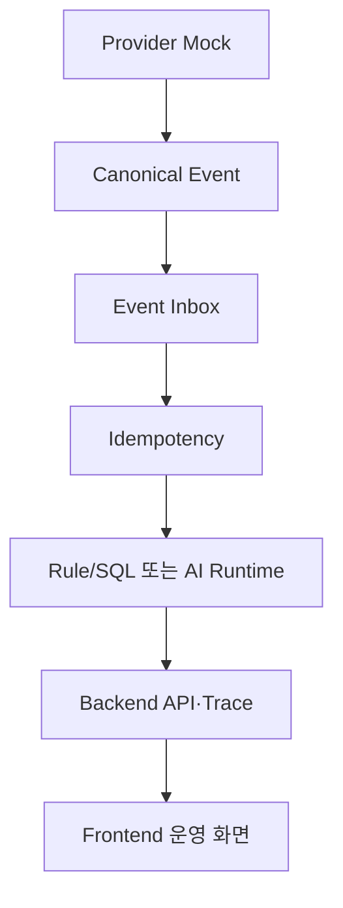

# AI Commerce Operations Agent

온라인몰·오프라인 매장·ERP에 흩어진 주문, 판매, 재고, 입고, 고객문의 데이터를 하나의 운영 흐름으로 연결하고, AI가 근거가 있는 분류·검색·초안·제안을 제공하도록 만드는 **21일 Portfolio Core Build**입니다.

현재 기준점은 **Day 4 첫 3트랙 통합 검증 완료**입니다. AI/ML과 Backend/Data의 Day 4 범위는 완료됐고, Frontend/Product는 안전·부분실패 검증을 통과했습니다. 다만 Backend의 요약 Insight와 Frontend의 상세 Evidence 계약 차이를 실제 연동에서 발견해 Day 4 전체 판정은 **부분 완료**로 유지합니다. 이 차이는 임시 데이터를 만들어 숨기지 않고 Day 8과 Day 12의 공식 일정에서 다시 검수합니다.

## 프로젝트가 해결하려는 문제

커머스 운영자는 보통 Cafe24 주문, Toss POS 판매, eCount 재고·입고, 고객문의와 운영 일정을 서로 다른 화면에서 확인합니다. 이 프로젝트는 다음 문제를 줄이는 것을 목표로 합니다.

- 채널별 데이터 형식과 식별자가 달라 재고와 주문을 한눈에 보기 어려운 문제
- 같은 이벤트가 반복 수신될 때 재고·업무가 중복 반영되는 문제
- 재고 부족, 예약 주문, 입고 지연을 뒤늦게 발견하는 문제
- AI 답변이 어떤 데이터와 규칙을 근거로 했는지 알기 어려운 문제
- 오래된 데이터, 낮은 신뢰도, 고위험 요청이 자동 실행으로 이어질 수 있는 문제
- Provider 일부 장애가 전체 운영 화면 장애로 확대되는 문제

## 핵심 기능

| 영역 | 구현·계획 기능 |
|---|---|
| 데이터 통합 | Cafe24, Toss POS, eCount 데이터를 Canonical Commerce Event와 공통 Provider Read Contract로 정규화 |
| 신뢰성 | Event Inbox, hash, quarantine 경계, tenant-aware idempotency, business effect 1회 보장 |
| 재고 운영 | 채널별 snapshot, append-only ledger, 예상재고, 예약·입고예정, 재고 부족·불일치 탐지 |
| 고객문의 AI | Intent/Entity/Risk 분류, 근거 검색, 답변 초안, Human Review·Policy Deny 분기 |
| AI 실험 | Prompt 비교, RAG, QLoRA 후보, Graph/Memory/Agent/Router 평가와 비용·지연·오류 기록 |
| 운영 UI | 재고·주문·문의·일정·Insight·설정 화면, Evidence Drawer, 상태·위험·신선도 표시 |
| 안전 | Production Read-Only, global write kill, 외부 write 0, PII/Secret 비노출, 고위험 자동실행 금지 |
| 관측성 | request_id, trace_id, correlation_id, tenant_id, event_id를 통한 요청·결과 추적 |

## 세 트랙과 연결 방식

### AI/ML

AI/ML 트랙은 Taxonomy, 비식별, Dataset split, Synthetic/Golden Set, Prompt 평가, Retrieval, 모델 라우팅과 안전 판단을 담당합니다. 계산 가능한 재고와 수량은 AI에 맡기지 않고 Rule/SQL을 우선하며, AI는 문의 분류·검색·초안·복합 판단을 지원합니다.

### Backend/Data

Backend/Data 트랙은 Provider Adapter, Canonical Event, PostgreSQL 모델, Inbox, Idempotency, API, 안전 정책과 추적 로그를 담당합니다. Provider와 AI의 원본 결과를 Frontend가 직접 해석하지 않도록 Backend가 검증·저장·Projection 경계를 제공합니다.

### Frontend/Product

Frontend/Product 트랙은 React/Vite 기반 7개 운영 화면과 상태·근거·부분실패 UX를 담당합니다. Contract의 enum 값과 운영자용 한글 Label을 분리하고, Backend에 없는 Evidence나 제안을 화면에서 임의 생성하지 않습니다.

### 현재 실제 연결 흐름



재고 vertical slice는 다음 경로로 실제 확인했습니다.

```text
Toss POS Mock
→ Offline Sale Event
→ Event Inbox
→ Idempotency
→ deterministic Rule/SQL
→ 예상 재고·Insight API
→ Frontend 운영 Queue
```

문의 AI slice는 다음 경로로 확인했습니다.

```text
Inquiry Event
→ Event Inbox
→ Backend AIMockConsumer
→ deterministic MockAIRuntime
→ ai-response.v0.1 검증
→ Backend AI Result·Trace
```

AI Raw Response와 화면용 `InsightSummary`는 동일 계약이 아닙니다. 이후 실제 화면 연결은 아래 경계를 따릅니다.

```text
AI Response
→ Backend 검증·저장
→ Projection/Adapter
→ Frontend Insight Contract
```

## 안전 원칙

- Production Core Build는 **Read-Only**입니다.
- 환불, 주문 취소, 가격 변경, 실재고 변경, 결제·정산, 고객 답변 자동 전송을 실행하지 않습니다.
- `WRITE_MODE=disabled`, `GLOBAL_WRITE_KILL=true`를 기본값으로 사용합니다.
- Production write-like 요청은 Provider transport 전에 차단하고 deny audit를 남깁니다.
- 재고 계산은 Rule/SQL을 우선하며 Mock 결과를 실제 모델 결과로 표시하지 않습니다.
- 오래된 근거, 낮은 신뢰도, 고위험 요청은 Human Review 또는 Policy Deny로 보냅니다.
- 실제 고객 PII와 Credential은 Git, 일반 DB, 로그, 공개 Artifact에 저장하지 않습니다.

## 저장소 구조

```text
ai/                         AI·ML 데이터, Prompt, Retrieval, 평가, Mock Runtime
backend/app/                FastAPI, Provider Adapter, Event, DB, Service, 안전 정책
backend/tests/              Backend 단위·통합·안전·DB 시험
frontend/src/app/pages/     React/Vite 7개 Route Page
frontend/src/components/    공통 UI 컴포넌트
frontend/src/features/      도메인별 상태·상호작용
frontend/tests/             Vitest 단위·컴포넌트 시험
frontend/e2e/               Playwright 브라우저 시험
contracts/                  Event/API/AI 공통 계약과 계약 시험
artifacts/                  실험·통합 실행 증거
docs/project/               공식 프로젝트 기준 문서 사본
docs/                       Provider·운영 기록
```

Frontend는 React/Vite 구조입니다. Next.js식 `app/**/page.tsx`를 추가하지 않고 기존 `app/pages/*Page.tsx`와 `features/`를 확장합니다.

## Day 1~4 진행 기록

| Day | AI/ML | Backend/Data | Frontend/Product | 전체 판정 | 핵심 결과 |
|---:|---|---|---|---|---|
| 1 | 완료 | 완료 | 완료 | 완료 | 공통 계약·안전 기본값, 실험 기반, 7개 Route와 Mock 골격 |
| 2 | 완료 | 완료 | 완료 | 완료 | Taxonomy·비식별·합성 데이터, PostgreSQL 모델·Migration, 공통 UI 상태 |
| 3 | 완료 | 완료 | 완료 | 완료 | Prompt 기준선, Provider→Inbox→Idempotency, 관측성·Dashboard vertical slice |
| 4 | 완료 | 완료 | 부분 완료 | 부분 완료 | 첫 실제 통합, 안전·부분실패 PASS, 상세 Evidence 계약 Finding 발견 |

## Day 4 통합 결과

### AI/ML

- `D04-AI-01~05` 완료
- Zero-shot, Structured, Few-shot 비교와 95% CI 기록
- Few-shot을 `ADOPTED_FOR_DAY04_INTEGRATION_ONLY`로 제한적으로 잠금
- deterministic Mock AI Runtime과 HIGH/PROHIBITED 안전 분기 구현
- AI 전체 `98 passed`
- 해당 시점 프로젝트 회귀 `186 passed, 1 skipped`
- Day 4 추가 외부 모델 호출·비용 `0`

### Backend/Data

- `D04-BE-01`, `D04-BE-03~05` PASS
- `D04-BE-02` PASS_WITH_INTEGRATION_FINDINGS
- Inquiry AI effect 중복 실행 차단, raw response 불변, request/trace 일치 검증
- 실제 PostgreSQL 16 migration 검증 완료
- Ruff PASS, 해당 시점 전체 회귀 `198 passed`
- External Provider Write, External Model, Tool, Auto-send 호출 `0`

### Frontend/Product

- `D04-FE-01` PARTIAL / BLOCKED_BY_CONTRACT
- `D04-FE-02`, `D04-FE-03` PASS
- Vitest `108/108`, Production Build PASS
- Playwright Read-Only `1/1`, Degraded `1/1` PASS
- Backend 실제 Demo Event 전송과 Insight 조회 성공
- Backend에 없는 `evidence`, `proposal`을 임의 생성하지 않음

세 트랙의 테스트 수치는 서로 다른 시점과 범위의 실행 결과이므로 합산하지 않습니다.

## 트러블슈팅 기록

### AI/ML

| 문제 | 원인·위험 | 해결 |
|---|---|---|
| 이름·주소를 자유 텍스트 Regex로 지우면 상품명·지역명까지 과잉 제거 | 한국어 고유명사 경계가 불명확 | 이름·주소·주문식별자는 구조화 field 기반 tokenization으로 처리하고 전화·이메일 등만 pattern redaction 적용 |
| Synthetic 데이터가 실제 Private corpus와 겹치는지 Fixture만으로 판단할 수 없음 | 실제 검증 없이 overlap 0을 과장할 위험 | 저장소 밖 SANITIZED corpus와 HMAC fingerprint로 비교하고 원문을 Artifact에 기록하지 않음 |
| Zero-shot Intent 점수는 높지만 Entity 과추출 발생 | 작은 validation과 느슨한 Entity 경계 | Structured/Few-shot을 같은 Runner로 비교하고 error case를 분류; Few-shot은 Day 4 통합 후보로만 채택 |
| Few-shot p95 지연과 일부 Risk/Intent 경계 오류 | 표본 8건, outlier와 annotation ambiguity | 95% CI·비용·오류분석을 함께 기록하고 최종 Production Prompt 채택을 보류 |

### Backend/Data

| 문제 | 원인·위험 | 해결 |
|---|---|---|
| PostgreSQL migration 시험이 처음 SKIP | `POSTGRES_TEST_URL`과 disposable DB 없음 | Docker PostgreSQL 16을 구성해 upgrade→schema/constraint→downgrade→re-upgrade를 실제 검증 |
| 동일 Inquiry replay 시 AI effect 중복 가능 | Inbox identity와 consumer effect identity 경계 필요 | tenant·schema version·consumer 기준 idempotency를 분리해 effect 1회를 검증 |
| Backend가 AI raw response를 수정하면 계약 증거 훼손 | correlation 정보를 raw payload에 덧붙일 위험 | raw response는 불변으로 유지하고 request/trace/correlation은 Backend 저장·trace 계층에 분리 |
| 로그에 nested Authorization/PII가 우회 유입될 수 있음 | 최상위 field 차단만으로 부족 | dict/list 중첩을 재귀 검사하고 구조화 로그 context override도 차단 |

### Frontend/Product

| 문제 | 원인·위험 | 해결 |
|---|---|---|
| Vitest와 Playwright 설정·실행 범위 충돌 | 단위시험과 브라우저 시험의 환경이 다름 | 명령과 설정 경계를 분리하고 각각 별도 PASS 증거 기록 |
| TypeScript assertion만으로 실제 Backend 응답을 신뢰할 위험 | 런타임 계약 오류가 숨겨짐 | 실제 응답을 runtime validation하고 partial/degraded 상태로 안전하게 표시 |
| 비동기 요청 중 unmount·재요청 race | 오래된 응답이 최신 상태를 덮을 수 있음 | Abort와 상태 경계를 적용하고 관련 회귀시험 보강 |
| `model_run_id=null`을 Rule로 단정할 위험 | AI Mock도 null일 수 있어 provenance 오표시 | 출처가 불명확하면 UI에서 Rule/AI를 추론하지 않고 계약 Finding으로 유지 |

### 첫 통합에서 발견한 문제

Backend `/api/v1/insights`는 현재 요약용 `evidence_ids[]`와 `correlation_id`를 반환하지만 Frontend의 상세 `InsightSummary`는 구조화된 `evidence[]`와 `proposal`을 요구합니다. 또한 AI 공통 응답은 화면용 Insight 계약과 목적이 다르고, `model_run_id=null`만으로 Rule과 AI Mock을 구분할 수 없습니다.

이를 해결하기 위해 임시 필드나 가짜 Evidence를 추가하지 않았습니다. 현재 가능한 요약 데이터만 표시하고 상세 Evidence E2E는 차단 상태로 기록했습니다.

| Finding | 현재 조치 | 공식 재검수 |
|---|---|---|
| `D04-FE-INTEGRATION-001` — Backend Insight와 Frontend 상세 계약 차이 | Full EvidenceDrawer E2E를 PARTIAL로 기록 | Day 8 |
| `D04-CONTRACT-002` — AI Response와 화면용 Insight 계약 분리 필요 | Backend Projection/Adapter 경계로 설계 | Day 12 |
| `D04-CONTRACT-003` — provenance 판정 필드 부족 | null 값으로 Rule/AI를 추론하지 않음 | Day 12 |

## 주요 실행 명령

Windows CMD, 저장소 루트 `C:\ai-commerce-operations-agent` 기준입니다.

```cmd
cd /d C:\ai-commerce-operations-agent
ai_venv\Scripts\activate.bat
ai_venv\Scripts\python.exe -m pytest -q
ai_venv\Scripts\python.exe -m ruff check backend contracts scripts
npm --prefix frontend test
npm --prefix frontend run build
```

Playwright는 Backend와 Frontend 개발 서버가 실행 중인 상태에서 수행합니다.

```cmd
npm --prefix frontend run e2e -- read_only
npm --prefix frontend run e2e -- degraded
```

실제 PostgreSQL migration 시험은 개인 Test DB URL을 CMD 환경변수로 설정한 뒤 실행합니다. 자격증명은 README, Git, 로그에 저장하지 않습니다.

## 주요 통합 증거

- `artifacts/experiments/PROMPT-01/result.json`
- `artifacts/integration/day04/ai_trace.json`
- `artifacts/integration/day04/contract_report.json`
- `artifacts/integration/day04/defects.csv`
- Backend/Frontend 통합시험과 Playwright E2E 결과

## 다음 단계

Day 5는 세 트랙이 다시 독립적으로 진행됩니다.

- AI/ML: Retrieval corpus, metadata, Golden query, freshness, citation
- Backend/Data: Cafe24 공식 capability, Read Adapter, read-only guard, 보호 staging, 제한 smoke
- Frontend/Product: 재고 목록, 복합 필터, Read-Only 상세 패널

Day 5에서는 Day 4 Finding을 해결한다는 이유로 범위를 확장하지 않습니다. Inventory Evidence 상세 계약은 Day 8, AI→UI Projection과 provenance는 Day 12에 공식 재검수합니다.

## 공식 문서 기준

일정은 `08_21일_상세개발일정(4)(2).xlsx`, 데이터/API는 `05_데이터_API_명세서(2).md`, 운영 안전은 `06_운영안전_명세서(2).md`, 시험 완료 판단은 `09_테스트_평가계획서(2).md`를 우선합니다.

이 README는 프로젝트가 진행될 때마다 **검증된 결과와 실제 실행 증거만** 누적 갱신합니다. 예정 기능은 완료 기능과 구분하고, 실행하지 않은 시험은 PASS로 기록하지 않습니다.
