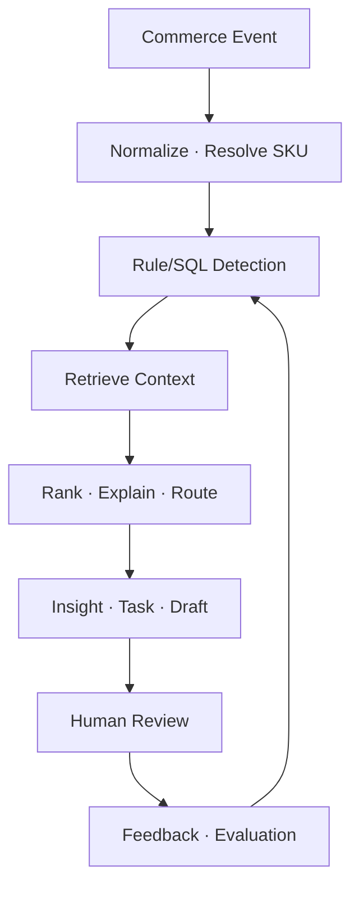

# 01. 프로젝트 종합기획서

> **이 문서는 무엇인가:** 프로젝트가 해결할 실제 사업 문제, 21일 범위, 우선순위와 성공 기준을 정하는 최상위 기획서다.  
> **언제 읽는가:** 개발 착수 전, 기능 범위가 흔들릴 때, 통합 확인일에 전체 목표를 다시 맞출 때 읽는다.  
> **한 문장 요약:** 실제 운영 시스템은 읽기 전용으로 보호하면서, 재고·예약주문·입고/출시 업무의 위험을 탐지하고 근거 있는 할 일을 제안하는 AI 운영 시스템을 만든다.

## 1. 기획 요약

AI Commerce Operations Agent는 Cafe24 온라인 주문, Toss POS 오프라인 판매, eCount 재고·입고 데이터를 Canonical Commerce Event로 통합해 운영 위험을 탐지하고, 원인과 근거를 제시하며, Task·일정·답변 초안을 생성하는 시스템이다. 21일은 실제 운영 자동화 완료 기한이 아니라 **Portfolio Core Build** 기한이다. Production은 Read-Only로 검증하고 공개 Demo는 동일 Pipeline의 Synthetic Tenant로 제공한다.

### 확인된 사업 기준

| 항목 | 현재 확인 내용 | 설계 영향 |
|---|---|---|
| 운영 시작 | 2026년 4월 | 짧은 시계열이므로 과도한 Forecasting 금지 |
| 온라인 | Cafe24, 판매 약 1,000건 이상 | 과거 주문·문의·취소/교환/반품을 비식별 Seed/Eval로 사용 가능 |
| 오프라인 | Toss POS, 판매 100건 이상 추정 | 금액 위주·상품 단위 이력 제한 가능; Mapping/Capability 확인 필요 |
| 재고 | eCount, Cafe24 판매는 반영 중 | API/Export/입고 데이터 범위 확인 전 Adapter capability를 확정하지 않음 |
| 상품 | 2,000종 이상 | SKU 대비 판매 희소성, Brand/Category fallback 필요 |
| 현 운영 | 오프라인 판매 후 사람이 온라인/eCount에 수동 반영 | Shadow Inventory와 안전한 후속 자동화가 최상위 가치 |
| 데이터 공개 | 실제 데이터 비공개, 고객 PII 제거 후 내부 테스트 동의 | 공개 Demo는 별도 Synthetic Tenant만 사용 |

## 2. 문제와 사업 근거

| 우선순위 | 확인된 Pain Point | 현재 상태(AS-IS) | 목표(TO-BE) |
|---|---|---|---|
| P0 | 온·오프라인 재고 통합 | Toss 판매 후 사람이 온라인/eCount에 반영 | 채널 Event 통합, 예상 재고·불일치·조치안 자동 산출 |
| P0 | 예약주문 누락 | 추가 발주를 놓쳐 배송 지연 | 예약→필요수량→입고예정→미처리 시간 추적·Task 상승 |
| P0 | 신상품/입고 일정 | 지연 시 후속 일정이 수동으로 꼬임 | 출시일 역산 Task, Dependency, 영향 분석, 재계획 제안 |
| P0 | 오늘의 업무 | 여러 시스템·일정에서 수동 선별 | Deadline·Risk·운영영향 기반 우선순위 |
| P1 | 고객문의 | 배송·재입고·재고·상품 문의를 수동 처리 | 분류·근거 Retrieval·답변 Draft, 전송은 승인 필요 |

## 3. 목표와 비목표

### 목표

- 3개 Provider의 데이터를 하나의 상품/SKU/주문/판매/재고/Event 모델로 통합한다.
- 예약주문·재고·일정 위험을 Rule/SQL 우선으로 탐지하고 AI가 설명·요약·행동안을 생성한다.
- RAG, Prompt, QLoRA, Graph, Agent, Model Router를 각각 Baseline과 비교하고 채택/기각 근거를 남긴다.
- 모든 Insight는 Source ID·시간·Confidence·계산 근거로 추적 가능해야 한다.
- Mock/Contract 기반으로 세 트랙이 독립 병렬 개발하고 4일 주기로 통합한다.
- Production 비공개 검증과 공개 Demo를 물리·논리적으로 분리한다.

### 21일 핵심 개발에서 하지 않는 것

- Production 자동 환불·주문취소·결제·가격변경·실재고 변경
- 범용 ERP/OMS 대체
- 모든 SKU의 딥러닝 수요예측
- AI가 작성한 CS 답변 자동 전송
- eCount/Toss의 확인되지 않은 기능을 가정한 구현

비목표는 영구 포기가 아니다. 검증된 저위험 재고 동기화는 Post-21 Pilot의 Shadow→승인 Write→제한 자동화로 발전한다.

## 4. 사용자와 핵심 여정

| Persona | 목적 | 핵심 여정 |
|---|---|---|
| 매장 운영자 | 오늘 놓치면 안 되는 일을 빠르게 처리 | Dashboard 위험 확인 → 근거 열기 → Task 승인/수정 |
| 상품/마케팅 담당 | 출시·입고 지연의 후속 영향 관리 | Launch Event → 역산 Task → 지연 Event → 재계획 승인 |
| CS 담당 | 근거 있는 답변 초안 작성 | Inquiry → Intent/Entity → Retrieval 근거 → Draft 검토 |
| 시스템 관리자 | 연동·권한·안전 상태 관리 | Provider 상태 → Mapping Queue → Kill Switch/Audit 확인 |
| 면접관/평가자 | AI Engineering 깊이 검증 | Demo Event → Pipeline Trace → 비교 실험/Metric → 결과 확인 |

## 5. 핵심 운영 흐름

## 6. 범위

### 핵심 업무 영역

- Product, Variant/SKU, Brand, BaseGame/Expansion/Component/Compatibility
- Online Order, Offline Sale, Reservation Order, Return/Cancel 기록
- Inventory Snapshot, Inventory Ledger, Incoming Stock
- Inquiry, Answer Draft, Evidence
- Launch/Reservation Event, Task, Dependency, Schedule
- Insight, Recommendation, Approval, Audit, Model Run

### 사용자 기능

홈, 상품·재고, 주문·판매, 고객문의, 운영일정, AI 분석, 연동·설정의 7개 영역으로 제한한다. 세부 화면 기준은 `07_화면_UI_UX_설계서.md`가 단일 기준이다.

## 7. 차별점

일반 Dashboard와 달리 상태를 보여주는 데서 끝나지 않고 `Event → 위험 탐지 → 관계/근거 분석 → 조치/Task → 일정 반영 → 승인`으로 이어진다. AI 기술 수가 아니라 다음 증거로 기술 깊이를 보여준다.

- Prompt 방식별 동일 Test Set 결과
- Base sLLM vs QLoRA vs Large LLM
- BM25 vs Vector vs Hybrid vs Hybrid+Reranker
- SQL/Hybrid vs Graph-aware Retrieval
- Large-only vs Router 비용·Latency·품질
- Full History vs Selective Memory
- Agent Retry/HITL/Resume/Failure Recovery 실행 Trace

## 8. 운영 모델과 트랙 배분

| Track | 계획 비중 | 일반 개발이 아닌 핵심 깊이 |
|---|---:|---|
| AI/ML | 45% | Dataset/Eval, Retrieval, Fine-tuning, Graph, Agent, Routing |
| Backend/Data | 40% | AI Serving, Feature/Retrieval Store, Event/Workflow, Telemetry, Safety Gateway |
| Frontend/Product | 15% | Decision UX, Evidence Trace, Simulator, 운영 Feedback |

각 트랙은 `05_데이터_API_명세서.md`의 계약 v0.1과 시험용 예시 데이터(Fixture)를 기준으로 시작한다. 통합 확인은 Day 4·8·12·16·20, 최종 확인은 Day 21이다.

외부 데이터 연동은 Day 1~4의 공통 계약·Mock 뒤에 진행한다. Day 5는 Cafe24 결정기록과 실제 Read Adapter, Day 6은 Toss POS/eCount의 API·Webhook·파일 중 실제 가능한 한 방식과 Adapter/Importer, Day 7은 cursor·rate limit·retry·재처리, Day 8은 원본 무변경을 포함한 읽기 전용 통합검증이다. API 미제공은 기능 삭제 사유가 아니며 같은 계약의 파일 Importer로 전환한다.

## 9. 성공 기준

### 제품 성공 기준

- Demo 이벤트 6종이 E2E로 처리되고 UI에서 원인·근거·Task를 확인할 수 있다.
- 예약주문 누락, 재고 불일치/위험, 입고 지연→일정 영향의 3개 핵심 시나리오가 재현된다.
- 실제 Provider Read 검증이 허용된 범위에서 이루어지고 운영 상태 무변경 증거가 있다.
- 모든 고위험 행동은 차단되며 Kill Switch가 동작한다.

### AI 엔지니어링 성공 기준

- 모든 AI 기능에 Baseline, 고정 Split/Golden Set, Metric, Error Analysis, 채택/기각 결정이 있다.
- 수치는 `09_테스트_평가계획서.md`의 평가 절차로 재현 가능하다.
- RAG 응답은 Citation Coverage와 Groundedness를 기록한다.
- Agent는 불필요한 LLM 호출을 피하고 Rule→sLLM→Small→Large 순으로 승격한다.

### 포트폴리오 성공 기준

- 실제 데이터·사업정보가 공개 Artifact에 0건 포함된다.
- Demo Tenant가 Production Credential/DB/Queue/Storage와 분리된다.
- README, 아키텍처, 실험 리포트, Demo Script, API 문서, 실행 영상으로 재현 가능하다.

정량 Gate의 구체 값은 `04`와 `09`에 정의한다. 실제 측정 전에는 목표와 결과를 구분해 `Result=PENDING`으로 유지한다.

## 10. 주요 가정·미확정·대응

| 항목 | 상태 | 대응 |
|---|---|---|
| eCount API/Export 범위 | 결정 전 `UNKNOWN/BLOCKED` | 공식 근거·필수 필드 확인 후 resource별 `API_POLL/FILE_IMPORT/UNSUPPORTED` 중 하나를 Day 6에 확정 |
| Toss POS 상품 단위 Event | 결정 전 `UNKNOWN/BLOCKED` | 공식 근거 확인 후 `API_POLL/WEBHOOK_PLUS_RECONCILIATION/FILE_IMPORT` 중 하나를 Day 6에 확정; 불명확 상품은 Mapping Queue |
| Cafe24 권한/Rate Limit | VERIFY | 최소 Read Scope, Rate Limit Test, Cursor/Checkpoint 수집 |
| 실제 문의량 | 제한 가능 | 실제는 Seed/Eval, 공개·Synthetic는 Train 보강, Test 오염 금지 |
| SKU Mapping 품질 | 주요 위험 | Exact→Rule→Human Queue, 불명확하면 자동 처리 금지 |

## 11. 21일 이후 추진계획

| Phase | 목적 | 승격 조건 |
|---|---|---|
| P1 실제 사업 시범운영 | 운영자가 분석 결과·할 일을 실제 업무와 비교 | 읽기 안정성·개인정보·감사 조건 통과 |
| P2 Shadow Inventory | 예상 재고 변경과 실제 수동 결과 비교 | 충분한 표본, SKU/수량/중복 정확도 충족 |
| P3 Human-Approved Write | 승인된 저위험 재고 변경만 Gateway 실행 | Allowlist, 재조회, Reconciliation, 복구 훈련 |
| P4 Verified Automation | 검증된 SKU/채널/조건만 제한 자동화 | 연속 관찰기간·오류율·Rollback 기준 충족 |
| P5 Stabilization | 예외·운영 UX·비용·보안 고도화 | 사업자 Feedback과 운영 SLO 기반 |

환불·결제·정산·주문취소·고객 개인정보 변경은 이 추진계획에서도 AI 자동 실행 금지 원칙을 유지한다.
