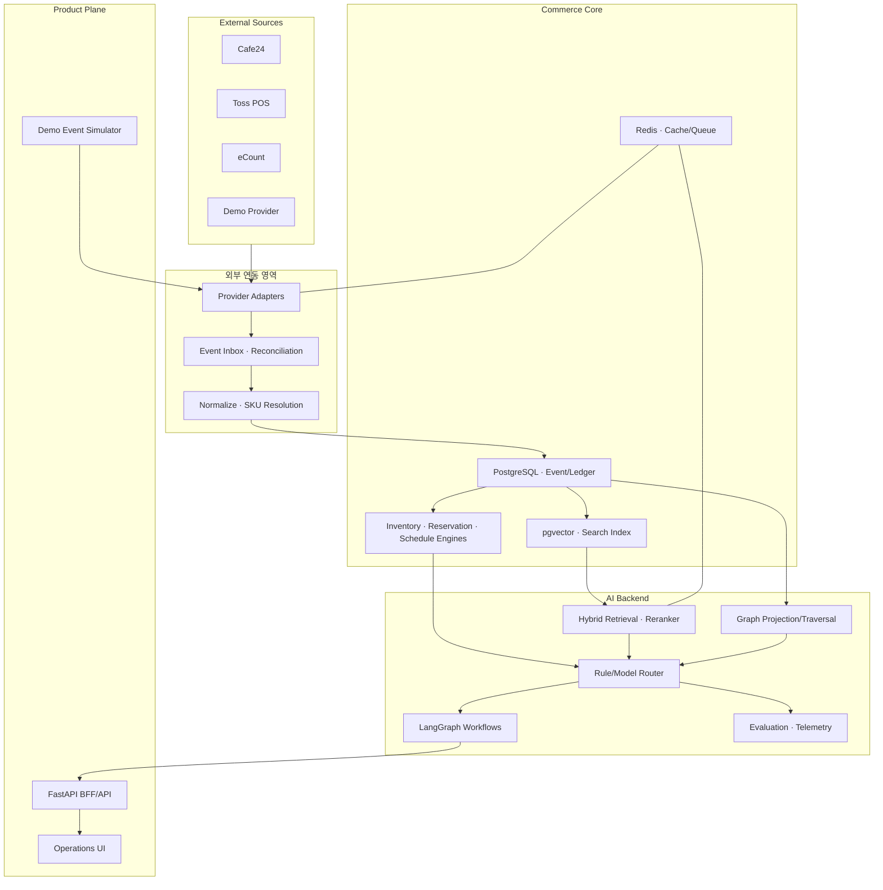
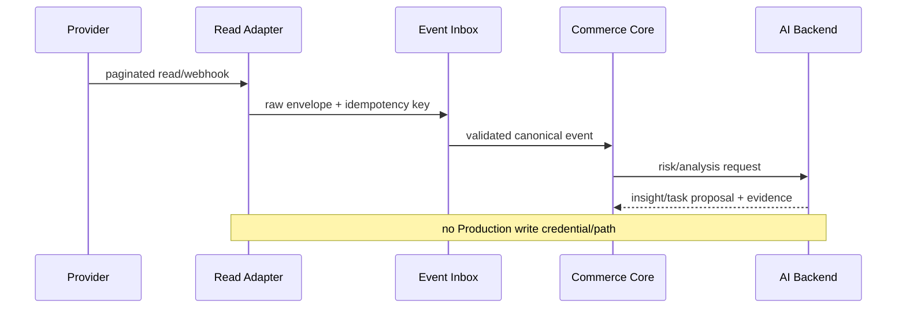

# 03. 시스템 아키텍처 설계서

> **이 문서는 무엇인가:** 시스템을 어떤 서비스와 모듈로 나누고 데이터가 어디로 흐르는지 정한다.  
> **언제 읽는가:** 폴더·서비스·DB를 만들기 전, 세 트랙 결과를 통합하기 전 읽는다.  
> **핵심 판단:** 외부 연동, 운영 데이터, AI 실행, 화면, 쓰기 기능을 분리하여 AI가 실제 운영 변경 권한을 갖지 않게 한다.

## 1. 설계를 좌우하는 기준

1. Production 피해 방지: AI와 외부 Write 경로 분리, Core Build Read-Only
2. Provider 불확실성 격리: Cafe24/Toss POS/eCount를 Adapter와 Capability Matrix로 추상화
3. 세 트랙 병렬성: Contract/Mock/Fixture 우선
4. 근거 추적: 모든 Event·Insight·Task·Model Run의 Correlation ID와 Source Lineage
5. AI 비용 통제: Rule/SQL/Retrieval/sLLM/LLM을 단계적으로 호출
6. Demo 분리: Production과 동일 Application Contract, 별도 Tenant/DB/Credential/Queue

## 2. 논리 구조



`AI Backend`에는 단순 모델 호출뿐 아니라 Retrieval orchestration, reranking, workflow state/checkpoint, tool policy, prompt/model registry, evaluation telemetry가 포함된다.

## 3. 구성요소별 책임

| Component | 책임 | 저장/출력 | 실패 시 |
|---|---|---|---|
| Provider Adapter | 외부 Auth, pagination, rate limit, raw→provider DTO | Raw envelope | retry/DLQ, source 상태 표시 |
| Event Inbox | dedupe, schema validation, checkpoint | immutable Event | quarantine, 재처리 가능 |
| Normalizer | canonical mapping, timezone/currency normalization | Canonical Entity/Event | invalid queue |
| SKU Resolver | exact/alias/rule 후보·confidence | mapping/version/review item | ambiguous는 자동 병합 금지 |
| Inventory Ledger | event-sourced expected stock, snapshot compare | ledger, discrepancy | stale/unknown 상태 |
| Reservation Engine | need/available/incoming/aging 계산 | risk, task candidate | rule-only fallback |
| Schedule Engine | template, dependency, collision, replan diff | task graph, proposal | 기존 일정 불변 |
| Retrieval Service | filter, BM25, dense, fusion, rerank, citation | evidence bundle | SQL/keyword fallback |
| Graph Projection | 관계 projection과 traversal | subgraph/evidence | SQL/RAG fallback |
| Model Router | task/risk/confidence/budget별 경로 선택 | route decision | smaller/rule/manual |
| Agent Runtime | explicit state, tool call, checkpoint, HITL | workflow state/audit | resume/manual queue |
| Write Gateway | 정책·승인·allowlist·idempotency·verify | write receipt | deny/stop/reconcile |
| 평가 서비스 | 데이터셋·모델·프롬프트·검색 지표 | 실험 실행 | 배포 보류 판단 |

## 4. 저장소 구조

| Store | 용도 | 금지 데이터/규칙 |
|---|---|---|
| PostgreSQL Operational | Canonical entity, ledger, event, task, schedule, audit metadata | PII는 tokenized reference만 |
| PII Vault/Protected Schema | 원문 연락처·주소 등 최소 보관 | AI/Vector/공개 Demo 접근 금지 |
| pgvector | 비식별 상품/정책/문의 표현 embedding | 고객 식별자·원문 PII 금지 |
| Search/BM25 Index | exact product/brand/정책 lexical retrieval | tenant/version filter 필수 |
| Redis | retrieval cache, rate limit, short queue, session summary cache | 장기 PII 저장 금지, TTL |
| Object Storage | 비식별 dataset, artifact, experiment output | environment별 bucket/key 분리 |
| Graph Projection | 관계 탐색용 materialized edges | Source ID/valid time 보존 |

초기 Graph는 PostgreSQL relation/recursive CTE 또는 경량 projection으로 시작한다. Graph DB는 traversal 성능·관리 편익이 실제 Baseline보다 나을 때만 추가한다.

## 5. 주요 데이터 흐름

### 5.1 실제 운영 자료 읽기



### 5.2 21일 이후 승인형 쓰기

21일 핵심 개발에서는 인터페이스와 데모용 연동기만 존재한다. 이후 시범운영에서 `제안 → 사람 승인 → 정책 확인 → 쓰기 전용 관문 → 외부 시스템 → 결과 재조회 → 차이 확인 → 감사 기록` 순으로 활성화한다. 세부 안전 조건은 `06_운영안전_명세서.md`에만 정의한다.

### 5.3 고객문의 처리

Inquiry ingest → PII redaction → sLLM intent/entity → structured lookup/filter → Hybrid Retrieval → risk route → Draft + citation → Human Review. 환불/분쟁/결제/취소는 Draft/Review 외 경로가 없다.

## 6. 외부 서비스 연동 추상화

```text
CommerceProvider
  capabilities() -> CapabilityMatrix
  read_products(request) -> ProviderReadPage[ProductDTO]
  read_orders(request) -> ProviderReadPage[OrderDTO]
  read_inventory(request) -> ProviderReadPage[InventoryDTO]
  read_inquiries(request) -> ProviderReadPage[InquiryDTO]
  read_incoming_stock(request) -> ProviderReadPage[IncomingDTO]
  verify_health()

WriteProvider (Core Build: DemoProvider only)
  propose_inventory_adjustment(...)
  execute_approved(command, idempotency_key)
  read_after_write(receipt)
```

지원하지 않는 기능은 빈 성공이 아니라 `UNSUPPORTED_CAPABILITY`를 반환한다. 공식 근거가 없는 기능은 `UNKNOWN/BLOCKED`이며 Production 동기화를 시작하지 않는다. eCount와 Toss POS의 실제 범위가 확인될 때까지 Adapter/Importer는 `CONTRACT_ONLY`로 표시한다.

### 6.1 읽기 결과와 동기화 상태 계약

```text
ProviderReadPage[T]
  items: list[T]
  next_cursor: string|null
  watermark: datetime|null
  has_more: bool
  request_count: int
  source_as_of: datetime|null

SyncState
  tenant_id, provider, resource
  connection_mode
  cursor, watermark, overlap_start
  last_success_at, last_error_code
  schema_version, state_version
```

cursor는 외부 호출 성공 직후가 아니라 `raw 저장 → 비식별 → 정규화 → 품질검사 → Canonical transaction commit`이 모두 성공한 뒤 갱신한다. 중간 실패 시 마지막 성공 cursor와 overlap window에서 다시 읽고 Idempotency가 두 번째 효과를 막는다. 파일 Importer는 `file_hash + batch_id + row_number`를 cursor에 해당하는 source identity로 사용한다.

### 6.2 연결 방식 선택 알고리즘

1. 공식 문서·계약 권한에서 읽기 API와 최소 scope가 확인되면 `API_POLL`.
2. Webhook이 있더라도 누락 가능성이 있으므로 `WEBHOOK_PLUS_RECONCILIATION`; 자동 등록이 외부 쓰기라면 Core Build에서 등록하지 않는다.
3. API가 없고 필요한 필드를 담은 Export가 있으면 `FILE_IMPORT`.
4. 운영자 파일 업로드만 가능하면 접근 제한된 `MANUAL_PROTECTED_IMPORT`.
5. 필수 상품코드·수량·시각·단위가 없으면 `UNSUPPORTED`. 숫자를 추정하지 않는다.
6. 공식 근거가 없으면 `UNKNOWN/BLOCKED`; DemoProvider로만 다음 트랙을 진행한다.

Provider별 구현 위치는 다음으로 고정한다.

```text
backend/app/adapters/providers/{cafe24,toss_pos,ecount}/capabilities.py
backend/app/adapters/providers/{cafe24,toss_pos,ecount}/adapter.py
backend/app/adapters/providers/{cafe24,toss_pos,ecount}/mapper.py
backend/app/adapters/importers/{toss_pos,ecount}.py
backend/app/sync/cursor_store.py
backend/app/sync/runner.py
backend/app/sync/retry_policy.py
```

### 6.3 한 페이지 수집 순서

`capability/scope 확인 → read-only transport → raw 보호 저장 → 비식별 → Provider DTO 검증 → Canonical 정규화 → 품질검사 → Inbox/Quarantine → DB transaction commit → cursor commit → 건수·감사 기록` 순서를 바꾸지 않는다. 429는 `Retry-After`, timeout/5xx는 상한 있는 exponential backoff+jitter를 적용하고 auth/schema 오류는 재시도하지 않는다.

## 7. 환경별 구성

| 환경 | 데이터 | 외부 권한 | AI 호출 | 목적 |
|---|---|---|---|---|
| Local/Test | fixture/synthetic | none/mock | stub 또는 test key | 단위·실험 개발 |
| Demo | synthetic Demo Tenant | DemoProvider only | budget 제한 | 공개 포트폴리오 |
| Production Read | 실제 비공개 | read-only 최소권한 | 비식별 context만 | 안전한 현황 검증 |
| Pilot Shadow | 실제 비공개 | read-only | 비식별 context만 | 예상값 vs 실제 수동 결과 |
| Pilot Approved | 실제 비공개 | allowlisted write gateway | AI는 proposal만 | 승인형 저위험 Write |

DB, queue, object storage, secret, domain, telemetry index를 환경별로 분리한다. Tenant ID만 바꾸는 논리 분리로 Production/Demo를 공유하지 않는다.

## 8. 세 트랙 간 연결 규칙

| Interface | Producer | Consumer | Contract Artifact | Mock |
|---|---|---|---|---|
| Canonical Event v1 | Backend | AI, Frontend | JSON Schema/OpenAPI | event fixtures |
| Evidence Bundle v1 | AI | Backend/UI | retrieval result schema | golden evidence fixture |
| Structured Intent v1 | AI | Backend | intent/entity JSON schema | recorded response |
| Insight/Task Proposal v1 | AI/Backend | UI | OpenAPI + reason codes | scenario fixtures |
| Agent State/Trace v1 | AI Backend | UI/Test | state schema + SSE events | deterministic trace |
| UI Action/Approval v1 | Frontend | Backend | command schema | mock server |
| Safety Decision v1 | Backend | all | allow/deny schema | deny-by-default policy |

Contract 변경은 consumer-driven test를 통과해야 한다. 타 트랙의 구현 완료를 의존성으로 두지 않고 `schema_version`, mock fixture, expected failure를 통해 진행한다.

### 8.1 AI 응답과 화면용 Insight의 Projection 경계

- `ai-response.v0.1`은 AI 실행 결과 계약이고 `Insight/Task Proposal v1`은 운영자 화면 계약이다. 두 객체를 같은 계약으로 취급하지 않는다.
- AI 응답을 화면에 노출할 때는 `AI Response → Backend Projection/Adapter → Insight/Task Proposal → Frontend` 경계를 사용한다. Raw AI 응답을 `/api/v1/insights`에 직접 섞지 않는다.
- 오프라인 판매와 예상 재고 계산은 결정론적 Rule/SQL 경로를 유지하고, 문의 분류만 해당 AI consumer로 전달한다.
- `model_run_id=null`은 “외부 모델 실행 없음”만 뜻한다. 이것만으로 Rule, AI Mock, Human을 구분하지 않는다. 명시적 provenance 계약이 확정되기 전 UI는 출처를 추론하지 않는다.

## 9. API 실행환경과 관측성

- FastAPI: REST/OpenAPI, SSE 또는 polling 기반 long-running agent status
- Background worker: ingestion, index build, evaluation, workflow resume
- Correlation: `request_id`, `event_id`, `thread_id`, `model_run_id`, `audit_id`
- Metrics: ingestion lag, duplicate rate, mapping ambiguity, retrieval latency/quality, route rate, token/cost, workflow failure, safety deny
- Logs: structured JSON, PII redaction, source/provider error code, model/prompt/index version
- Audit: append-only, action/decision/before-after/actor/policy/evidence hash

## 10. 장애 복구와 데이터 일관성

- Event processing: at-least-once + idempotent consumer
- Ledger: append-only transaction + periodic snapshot
- External read: cursor/checkpoint + overlap window + reconciliation
- Tool execution: deterministic idempotency key; timeout 후 상태 조회 전 재실행 금지
- RAG freshness: source version/as_of를 cache key에 포함
- Agent: checkpoint 후 node commit, side effect와 state commit의 receipt 연결
- Degraded mode: AI 장애 시 Rule/SQL Dashboard 유지, Draft/Insight는 unavailable로 표시

## 11. 주요 설계 결정

| ADR | 결정 | 이유 | 재검토 조건 |
|---|---|---|---|
| ADR-001 | 21일 핵심 개발에서 실제 운영환경 읽기 전용 | 사업 피해 방지 최우선 | 시범운영 진입 조건 통과 후 |
| ADR-002 | Event/Ledger 기반 예상 재고 | 중복·재처리·감사 가능 | Provider가 강한 transaction sync 제공 시 |
| ADR-003 | Hybrid retrieval을 후보로 두되 실험 후 채택 | exact name과 자연어 동시 필요 | Eval에서 단일 방식이 동등/우수 |
| ADR-004 | Graph DB 선도입 금지 | 관계가 필요한 Query만 제한적 | Graph traversal 성능/품질 이점 입증 |
| ADR-005 | LangGraph는 장기/분기/HITL Workflow에만 | 단순 호출의 복잡도 방지 | state/resume가 불필요한 task |
| ADR-006 | Demo와 Production 물리 분리 | 공개 유출과 오작동 차단 | 변경 없음 |
