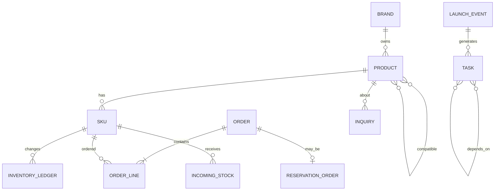

# 05. 데이터·API 명세서

> **이 문서는 무엇인가:** AI·백엔드·화면 트랙이 서로 기다리지 않고 개발하도록 데이터 필드와 요청·응답 형식을 고정한 공동 계약서다.  
> **언제 읽는가:** DB 모델, API, Mock, Fixture, 화면 데이터 타입을 만들기 전에 읽는다.  
> **변경 원칙:** 필드를 바꿀 때는 문서와 버전을 먼저 바꾸고, 계약 테스트를 통과시킨 뒤 각 트랙에 전달한다.

## 1. 공동 계약 원칙

- Contract First, Mock First, versioned schema
- 외부 Provider ID와 Canonical ID를 모두 보존
- 모든 Record에 `tenant_id`, `source`, `source_id`, `occurred_at`, `ingested_at`, `schema_version`
- live 값에는 `as_of`와 freshness 상태 필수
- command와 event 분리: command는 의도, event는 발생 사실
- API/AI 응답은 `request_id`, `trace_id`, `evidence_ids`, `warnings`를 공통 포함
- 실제 PII는 protected reference로만 연결하며 AI Contract에는 전달하지 않음

## 2. 표준 데이터 개체 모델



### 2.1 핵심 테이블

| Entity | Primary fields | 불변/검증 규칙 |
|---|---|---|
| Tenant | id, name, environment, status | Demo/Production ID space 분리 |
| ProviderAccount | provider, account_ref, capability, credential_ref | secret 원문 저장 금지 |
| Brand | id, canonical_name, aliases | alias provenance |
| Product | id, name, brand_id, category, language, player_count, play_time, difficulty | valid range/schema |
| SKU | id, product_id, option, barcode, status | tenant 내 canonical uniqueness |
| ProductRelation | from_id, to_id, relation_type, confidence, source | directed type validation |
| ProviderMapping | provider, object_type, external_id, canonical_id, confidence, status, version | ambiguous는 approved=false |
| Order | id, provider, external_id, type, status, ordered_at, customer_ref | customer_ref는 tokenized |
| OrderLine | order_id, sku_id, external_sku_text, qty, unit_amount | qty > 0, currency typed |
| SaleEvent | event_id, channel, sku_id, qty, amount, occurred_at | idempotency unique |
| InventorySnapshot | provider, sku_id, on_hand, reserved, as_of | source별 최신 version |
| InventoryLedger | ledger_id, sku_id, delta, reason, source_event_id, occurred_at | append-only |
| ReservationOrder | order_id, promised_date, required_qty, secured_qty, status, aging | state transition rule |
| IncomingStock | id, sku_id, qty, expected_at, confidence/status | confirmed vs tentative 구분 |
| Inquiry | id, channel, sanitized_text, intent, entities, risk | PII status=clean 필요 |
| LaunchEvent | id, product_id, launch_at, flow_template, status | timezone 필수 |
| Task | id, type, title, deadline, priority, status, source_reason | proposed/approved 분리 |
| TaskDependency | predecessor_id, successor_id, lag | cycle 검증 |
| Insight | id, type, severity, confidence, summary, evidence_ids | evidence 1개 이상 또는 no-evidence reason |
| Approval | id, action_type, payload_hash, actor, decision, expires_at | immutable decision history |
| AgentRun | workflow/thread/model/prompt/state/checkpoint/cost | state schema version |
| AuditEvent | actor, action, target, before_hash, after_hash, policy, outcome | append-only |

### 2.2 제한된 상태값

- `environment`: LOCAL, TEST, DEMO, PRODUCTION_READ, PILOT_SHADOW, PILOT_APPROVED
- `provider`: CAFE24, TOSS_POS, ECOUNT, DEMO
- `order_type`: STANDARD, RESERVATION
- `relation_type`: BASE_GAME_OF, EXPANSION_OF, CONTAINS, ACCESSORY_FOR, COMPATIBLE_WITH, PROMO_FOR
- `risk_level`: LOW, MEDIUM, HIGH, PROHIBITED
- `task_status`: PROPOSED, APPROVED, IN_PROGRESS, DONE, BLOCKED, DISMISSED
- `approval_decision`: APPROVE, REJECT, EDIT, EXPIRED
- `freshness`: FRESH, STALE, UNKNOWN

## 3. 공통 데이터 포장 형식

```json
{
  "schema_version": "1.0",
  "tenant_id": "demo_store",
  "request_id": "req_...",
  "trace_id": "tr_...",
  "data": {},
  "evidence_ids": [],
  "warnings": [],
  "as_of": "2026-08-30T12:00:00Z"
}
```

Error:

```json
{
  "error": {
    "code": "AMBIGUOUS_SKU_MAPPING",
    "message": "Human mapping required",
    "retryable": false,
    "details": {"candidate_ids": ["sku_a", "sku_b"]}
  },
  "request_id": "req_...",
  "trace_id": "tr_..."
}
```

## 4. REST API 버전 1

### 4.1 조회 API 목록

| Method | Path | 목적 | 주요 Query/Body |
|---|---|---|---|
| GET | `/api/v1/health` | app/provider/index 상태 | none |
| GET | `/api/v1/dashboard` | 오늘의 KPI/긴급/Task/Insight | `as_of`, channel |
| GET | `/api/v1/products` | 상품·SKU·mapping/freshness | search, brand, category, risk |
| GET | `/api/v1/inventory` | channel snapshot/expected/risk | sku/product, freshness |
| GET | `/api/v1/orders` | 주문/판매/예약/반품 조회 | channel, type, status, period |
| GET | `/api/v1/reservations` | 부족수량·aging·incoming | risk, product |
| GET | `/api/v1/inquiries` | 분류·evidence·draft | intent, risk, status |
| GET | `/api/v1/launch-events` | 출시/입고/Task graph | date range, status |
| GET | `/api/v1/tasks` | 오늘의 업무/priority | owner, status, source |
| GET | `/api/v1/insights` | AI/rule insight | type, severity, confidence |
| GET | `/api/v1/traces/{trace_id}` | pipeline/audit trace | redact=true |

### 4.2 내부·데모용 명령

| Method | Path | 허용 환경 | 동작 |
|---|---|---|---|
| POST | `/api/v1/demo/events` | DEMO | Simulator Event 발행 |
| POST | `/api/v1/tasks/{id}/decision` | DEMO/내부 | 제안 Task 승인/거절/수정 |
| POST | `/api/v1/inquiries/{id}/draft` | DEMO/내부 | 근거 기반 Draft 생성 |
| POST | `/api/v1/workflows` | DEMO/내부 | Agent workflow 시작 |
| POST | `/api/v1/workflows/{id}/resume` | DEMO/내부 | HITL/checkpoint 재개 |
| POST | `/api/v1/reconciliation/run` | 권한 사용자 | read-only 비교 Report |
| POST | `/api/v1/write-proposals` | DEMO/PILOT | 외부 Write가 아닌 proposal 생성 |
| POST | `/api/v1/write-proposals/{id}/approve` | DEMO/PILOT_APPROVED | 승인; Core Production 정책은 실행 차단 |

외부 Provider Write 실행 endpoint는 Public API에 노출하지 않는다. 전용 worker가 Write Gateway policy와 receipt를 통해서만 실행한다.

### 4.3 AI 서비스 연결 규격

```text
POST /internal/v1/nlu/extract
POST /internal/v1/retrieval/search
POST /internal/v1/rerank
POST /internal/v1/graph/query
POST /internal/v1/agent/run
POST /internal/v1/evaluation/run
GET  /internal/v1/experiments/{id}
```

각 요청은 `task_type`, `risk_level`, `budget`, `model_policy`, `prompt_version`, `input_schema_version`을 포함한다. Backend가 모델명을 직접 하드코딩하지 않고 Router Policy를 호출한다.

## 5. 이벤트 데이터 계약

### 5.1 표준 이벤트 포장 형식

```json
{
  "event_id": "evt_provider_unique_or_hash",
  "event_type": "offline_sale.recorded",
  "schema_version": "1.0",
  "tenant_id": "demo_store",
  "source": "TOSS_POS",
  "source_event_id": "external-123",
  "occurred_at": "2026-08-30T10:15:00Z",
  "ingested_at": "2026-08-30T10:15:04Z",
  "idempotency_key": "TOSS_POS:external-123:v1",
  "correlation_id": "corr_...",
  "payload": {
    "external_product_text": "Example Game KR",
    "sku_id": "sku_demo_001",
    "mapping_confidence": 1.0,
    "quantity": 1,
    "amount": {"currency": "KRW", "value": 39000}
  }
}
```

### 5.2 이벤트 종류

| Domain | Types |
|---|---|
| 외부 연동 | provider.sync.started/completed/failed, mapping.review_required |
| Commerce | order.created/updated, offline_sale.recorded, return.recorded |
| Inventory | inventory.snapshot_received, expected_changed, discrepancy_detected |
| Reservation | reservation.created, shortage_detected, purchase_pending, incoming_updated, fulfilled |
| Schedule | launch.created/changed, incoming.delayed, task.blocked, replan.proposed |
| Inquiry | inquiry.received/classified, draft.generated/reviewed |
| Agent | workflow.started/checkpointed/waiting_approval/completed/failed |
| Safety | action.denied, kill_switch.changed, reconciliation.mismatch |

## 6. 외부 서비스 연동 계약과 지원범위 표

```json
{
  "provider": "ECOUNT",
  "capabilities": {
    "products_read": "UNKNOWN",
    "orders_read": "UNKNOWN",
    "inventory_read": "VERIFY",
    "incoming_stock_read": "VERIFY",
    "webhook": "UNKNOWN",
    "inventory_write": "DISABLED_CORE"
  },
  "checked_at": "...",
  "evidence_ref": "..."
}
```

Capability는 `SUPPORTED`, `UNSUPPORTED`, `VERIFY`, `UNKNOWN`, `DISABLED_CORE` 중 하나다. 추정치를 `SUPPORTED`로 기록하지 않는다.

### 6.1 Provider 연결 결정기록

Provider/resource마다 아래 필드가 없으면 Production 수집을 시작할 수 없다.

```json
{
  "provider": "CAFE24",
  "resource": "orders",
  "status": "UNKNOWN",
  "connection_mode": "CONTRACT_ONLY",
  "official_evidence_ref": null,
  "checked_at": null,
  "checked_by": null,
  "api_version": null,
  "auth_type": null,
  "read_scopes": [],
  "resource_or_endpoint": null,
  "export_menu": null,
  "pagination": null,
  "rate_limit": null,
  "history_window": null,
  "incremental_key": null,
  "required_fields": [],
  "fallback": "DEMO_PROVIDER"
}
```

`connection_mode` 허용값은 `API_POLL`, `WEBHOOK_PLUS_RECONCILIATION`, `FILE_IMPORT`, `MANUAL_PROTECTED_IMPORT`, `CONTRACT_ONLY`, `UNSUPPORTED`다. Endpoint·scope·제한은 공식 근거에서만 옮기며 문서가 확인되지 않으면 `null + UNKNOWN/BLOCKED`를 유지한다.

### 6.2 공통 읽기 페이지

```json
{
  "provider": "CAFE24",
  "resource": "orders",
  "items": [],
  "next_cursor": null,
  "watermark": null,
  "has_more": false,
  "request_count": 1,
  "source_as_of": "2026-01-01T00:00:00Z",
  "schema_version": "provider-read-page.v1"
}
```

파일 Importer는 동일 응답을 사용하되 각 item의 source identity에 `file_hash`, `batch_id`, `row_number`를 넣는다. 원문 파일명만으로 중복을 판정하지 않는다.

### 6.3 동기화 상태와 commit 규칙

```json
{
  "tenant_id": "tnt_demo",
  "provider": "TOSS_POS",
  "resource": "sales",
  "connection_mode": "FILE_IMPORT",
  "cursor": "file_sha256:batch_001:row_500",
  "watermark": "2026-01-01T00:00:00Z",
  "overlap_start": null,
  "last_success_at": "2026-01-01T00:05:00Z",
  "last_error_code": null,
  "schema_version": "sync-state.v1",
  "state_version": 7
}
```

cursor/state version은 Canonical DB transaction 성공 뒤 compare-and-set으로 갱신한다. 일부 item이 실패하면 정상 item과 Quarantine 건수를 기록하고, 정책에 따라 page 전체 rollback 또는 item 단위 격리를 선택한 사실을 manifest에 남긴다.

### 6.4 표준 연동 오류코드

| 코드 | 의미 | 처리 |
|---|---|---|
| `AUTH_SCOPE_INVALID` | 최소 읽기 scope가 아님 | 호출 전 차단, 재시도 없음 |
| `PROVIDER_WRITE_BLOCKED` | write method/path 시도 | 호출 0, 안전 감사 기록 |
| `RATE_LIMITED` | 429 또는 quota | Retry-After와 재시도 상한 적용 |
| `CURSOR_EXPIRED` | cursor가 더 이상 유효하지 않음 | 승인된 overlap 재조회 후 대사 |
| `SCHEMA_MISMATCH` | DTO 계약 불일치 | 해당 page 격리, 재시도 없음 |
| `PARTIAL_PAGE` | page 일부 처리 실패 | cursor 미전진 또는 명시적 item 격리 |
| `UNSUPPORTED_CAPABILITY` | Provider가 기능 미지원 | 빈 성공 금지, 대체 방식 표시 |
| `PII_BOUNDARY_VIOLATION` | 비식별 경계 실패 | AI/index/public 파이프라인 즉시 차단 |

## 7. 분석 결과·근거·할 일 계약

```json
{
  "insight_id": "ins_...",
  "type": "RESERVATION_SHORTAGE",
  "severity": "HIGH",
  "confidence": 0.97,
  "summary": "예약 수량 대비 확정 재고가 2개 부족합니다.",
  "calculation": {
    "reserved": 5,
    "available": 1,
    "confirmed_incoming": 2,
    "shortage": 2
  },
  "evidence": [
    {"source_type": "order", "source_id": "ord_demo_1", "as_of": "..."},
    {"source_type": "incoming_stock", "source_id": "inc_demo_1", "as_of": "..."}
  ],
  "proposal": {
    "action": "CREATE_TASK",
    "risk_level": "LOW",
    "requires_approval": false
  },
  "model_run_id": null,
  "rule_version": "reservation-risk-v1"
}
```

결정론적 Insight는 `model_run_id=null`이어야 하며 AI가 계산한 것처럼 표시하지 않는다. AI explanation을 추가하면 별도의 model run과 source calculation을 연결한다.

### 7.1 API Projection과 provenance 해석

- `/api/v1/insights`의 화면 소비 계약은 위 `Insight` 구조를 따른다. 공통 Envelope의 `evidence_ids` 또는 저장소 내부 참조만으로 `evidence[]`의 `source_type`, `source_id`, `as_of`를 대체하지 않는다.
- `ai-response.v0.1`과 화면용 `Insight`는 목적이 다르다. AI 결과는 Backend Projection/Adapter에서 검증·변환한 뒤 화면 계약으로 노출하며 Raw AI 응답을 Frontend가 직접 소비하지 않는다.
- Backend에 없는 `evidence`, `proposal`, `as_of`를 Frontend가 임의 생성하지 않는다. 필요한 상세값이 없으면 `Evidence unavailable`과 no-action 상태를 사용한다.
- `model_run_id=null`만으로 결과를 Rule 기반이라고 판정하지 않는다. Rule/AI Mock/AI Model/Human 구분 방식은 공동 계약으로 확정하기 전까지 미정이며, 소비자는 출처를 추론하지 않는다.

## 8. 에이전트 상태와 승인 계약

- optimistic state version으로 concurrent resume 차단
- `expected_state_version` 불일치 시 409
- Approval payload는 hash로 고정하여 승인 후 내용 변경 차단
- 승인 만료/정책 변경 시 재승인
- tool receipt는 provider response ID, expected/actual, read-after-write를 포함

## 9. 버전과 호환성

- URI major version: `/v1`
- additive optional field: minor schema version, consumer tolerant
- enum/required/semantic change: breaking, `/v2` 또는 migration
- Event consumer는 알 수 없는 field를 무시하지만 알 수 없는 event type은 quarantine
- OpenAPI/JSON Schema 생성물과 Mock fixture를 CI에서 diff
- Contract Test: Backend provider, AI consumer, Frontend consumer 각각 실행

## 10. 데이터 품질 규칙

| Rule | 처리 |
|---|---|
| missing tenant/source/external ID | reject/quarantine |
| invalid timezone/currency/qty | reject with reason |
| unknown SKU | unresolved mapping queue, inventory mutation 금지 |
| duplicate event | acknowledge, no second effect |
| stale inventory | `STALE`, high-confidence action 금지 |
| conflicting provider stock | discrepancy insight, source priority를 임의 적용하지 않음 |
| PII detector hit after redaction | AI/index/dataset pipeline 차단 |
