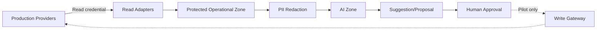

# 06. 운영안전 명세서

> **이 문서는 무엇인가:** 실제 사업 피해를 막기 위한 최우선 규칙과 차단 장치를 정한다.  
> **언제 읽는가:** 실제 계정·주문·문의·재고 자료에 접근하기 전, 에이전트 도구를 추가하기 전, 모든 통합 확인일에 읽는다.  
> **절대 원칙:** Production은 초기 읽기 전용이며 금전·환불·주문취소·가격·실재고 변경을 AI가 자동 실행하지 않는다.

## 1. 최상위 정책

**사업 피해 방지가 기능·일정·AI 성능보다 우선한다.** 21일 Core Build에서 Production은 Read-Only이고 AI는 Suggestion-Only다. 금전·환불·주문취소·가격·실재고·판매상태·고객정보를 AI가 자동 변경하지 않는다.

이 문서의 안전 확인 조건을 통과하지 못한 기능은 코드·화면·HTTP 200 응답과 무관하게 완료가 아니다.

## 2. 위험 등급

| Level | 예 | Core Build | Post-21 |
|---|---|---|---|
| R0 Read | 주문/재고 조회, Dashboard | 허용 | 허용 |
| R1 Internal | 위험 계산, Insight, Draft, Task/일정 제안 | 허용 | 허용 |
| R2 External Low-risk Write | 검증된 SKU 재고 동기화, 답변 전송 | Production 차단; Demo만 | Pilot+승인+Allowlist 후 제한 |
| R3 Prohibited Autonomy | 환불, 결제, 정산, 주문취소, 가격, PII 수정 | 자동 실행 금지 | AI 자동 실행 금지 |

## 3. 신뢰 경계

- AI Zone에는 Production Credential이 없다.
- Demo와 Production은 DB/queue/storage/secret/domain을 공유하지 않는다.
- Write Gateway는 Application과 별도 permission boundary다.

## 4. 21일 핵심 개발의 통제 장치

### 4.1 자격증명과 권한

- Provider별 read-only service account 또는 최소 scope token
- CI/Local/Demo/Production secret 분리, repo·문서·로그 저장 금지
- 실제 운영환경 쓰기 권한이 토큰에 존재하면 연결 조건 실패
- credential rotation/expiration/owner 기록
- break-glass account는 Core Build 사용 금지

### 4.2 네트워크와 애플리케이션

- AI runtime에서 Provider write endpoint egress 차단 또는 deny policy
- write-like HTTP method/path allowlist 없음이 기본
- environment assertion: Production에서 `WRITE_MODE=disabled`
- startup 시 credential capability 검사; 불확실하면 서비스 degraded/read-only
- UI의 승인 버튼이 있어도 Core Production 실행 endpoint 미노출

### 4.4 실제 Read 연결 체크리스트

연결 전:

- 소유자 승인, 테스트 시간, Provider/resource, 최대 page/item/time을 기록한다.
- 공식 근거의 인증·최소 read scope·resource/endpoint 또는 export 메뉴를 결정기록과 대조한다.
- write scope가 포함되거나 scope 확인이 불가능하면 실패 처리한다. 화면에서 버튼만 숨기는 것으로 대체하지 않는다.
- HTTP method/path allowlist, secret 마스킹, raw 저장 위치, 중단 명령을 사전 시험한다.

연결 중:

- API는 확정된 read method/path만, 파일은 승인된 읽기 사본만 사용한다.
- 자동 webhook 등록처럼 외부 설정을 바꾸는 호출은 Core Build에서 실행하지 않는다.
- `max_pages`, `max_items`, timeout, 요청 예산을 초과하면 안전하게 종료한다.
- 요청/응답 본문을 로그에 남기지 않고 request ID, masked path, status, count, hash만 남긴다.

연결 후:

- raw/sanitized/canonical/quarantine 건수를 대사한다.
- PII/Secret scan 결과 0, write call count 0, source 상태 before/after 동일을 확인한다.
- Provider별 `LIVE_READ`, `FILE_IMPORT`, `CONTRACT_ONLY`, `UNSUPPORTED` 검증 수준을 기록한다.
- 실제 데이터가 포함된 증거는 비공개 보호 저장소에만 두고 공개 포트폴리오에는 구조와 합성 결과만 공개한다.

### 4.3 긴급 차단 스위치

| Switch | 차단 범위 | 유지 기능 |
|---|---|---|
| Global Write Kill | 모든 external write | read, analysis, audit |
| Provider Kill | 특정 Provider tool | 다른 Provider read |
| AI Kill | model/agent call | rule/SQL dashboard |
| Workflow Kill | 신규 workflow/auto resume | 기존 상태 조회/manual handling |

Kill Switch 변경은 이중 권한과 Audit 대상이다. Core Build에서 Global Write Kill은 항상 ON이다.

## 5. 쓰기 전용 관문 — 21일 이후 설계

다음 단계가 하나라도 실패하면 Provider를 호출하지 않는다.

1. environment=PILOT_APPROVED 확인
2. global/provider kill switch 확인
3. action/tenant/SKU/channel allowlist
4. 승인 Actor/role/만료/payload hash 검증
5. idempotency key 중복 검사
6. SKU mapping confidence=approved
7. 수량/변경폭/현재값/freshness/safety threshold
8. optimistic precondition (`expected_current`)
9. Provider call
10. read-after-write
11. expected==actual
12. Audit receipt와 reconciliation

Timeout 후 성공 여부가 불명확하면 즉시 재호출하지 않는다. provider operation 조회 또는 read reconciliation 후 결정한다.

## 6. 행동별 허용 정책

| Action | AI | Human | Gateway | 자동화 가능성 |
|---|---|---|---|---|
| Dashboard/분석 | 생성 가능 | 선택 검토 | 불필요 | 가능 |
| Task 생성/우선순위 | 제안/내부 생성 | 수정/종료 | 불필요 | 가능 |
| 예약주문 경고 | 생성 가능 | 확인 | 불필요 | 가능 |
| 일정 재계획 | Diff 제안 | 승인 | 내부 일정에만 | 승인형 |
| CS 답변 | Draft | 전송 승인 | 필요 | 자동전송 기본 금지 |
| 재고 동기화 | 예상값 제안 | Pilot 승인 | 필수 | 검증된 저위험 조건만 |
| 가격/판매상태 | 제안만 | 필수 | 필수 | 자동화 금지 기본 |
| 환불/결제/정산/취소 | 필요성 알림만 | 운영 시스템에서 처리 | AI 경로 없음 | 자동화 금지 |
| 고객 PII 변경 | 수행 금지 | 운영 시스템에서 처리 | AI 경로 없음 | 자동화 금지 |

## 7. 이벤트, 중복 실행 방지, 차이 확인

- source event ID가 있으면 `provider:tenant:event_id:version`
- 없으면 immutable fields의 canonical hash + time bucket, collision review
- Inbox unique constraint와 processed effect unique constraint를 분리
- Ledger는 append-only; correction은 reverse/adjust event로 남김
- overlap-window polling으로 webhook 누락 탐지
- daily/triggered reconciliation: provider snapshot vs expected ledger
- mismatch는 자동 보정하지 않고 Review Queue

## 8. 상품코드 연결 안전

| 상태 | 조건 | 처리 |
|---|---|---|
| VERIFIED | barcode/external ID 승인 mapping | Shadow 계산 가능 |
| RULE_MATCH | deterministic alias/rule, 높은 confidence | 표시·Shadow, Write 전 승인 요구 |
| AMBIGUOUS | 복수 후보/옵션 불명 | 격리, 자동 계산 영향 표시, Write 금지 |
| UNKNOWN | 후보 없음 | Manual Queue, Write 금지 |
| CONFLICT | Provider mapping 충돌 | 관련 automation 중지 |

Mapping 변경은 versioned이며 과거 Ledger의 당시 mapping을 보존한다.

## 9. 개인정보와 데이터 관리

### 9.1 금지 위치

Prompt/response log, vector index, QLoRA dataset, experiment artifact, error tracker, public repo, Demo DB에 이름·전화·주소·이메일·상세 주문 식별정보를 저장하지 않는다.

### 9.2 처리 흐름

raw protected ingest → field classification → tokenization/redaction → automated scan → human sample validation → AI/index eligibility. Detector hit가 남으면 pipeline을 fail closed한다.

### 9.3 보관 기간

- raw/PII: 사업상·법적 최소기간과 접근 감사
- sanitized AI data: purpose/version/consent/license 기록
- log: payload 대신 hash/ID, 제한된 retention
- deletion request는 raw, derived, index, dataset lineage로 추적

## 10. AI 안전 확인 조건

- output schema validation
- evidence/citation required for factual recommendation
- source freshness and access scope
- risk classifier + deterministic prohibited action filter
- confidence calibration; low confidence는 human route
- prompt injection: external text를 untrusted data로 구분, tool instruction으로 해석 금지
- tool arguments canonical validation
- budget/rate limit/model timeout
- model/prompt/index version audit

## 11. 감사 기록 요구사항

모든 민감 결정은 `who/what/when/where/why/input hash/output hash/policy/version/outcome/correlation`을 기록한다. Audit log는 append-only이고 관리자도 수정할 수 없으며 조회 권한을 분리한다.

필수 Audit:

- Provider sync와 capability change
- mapping create/approve/change
- AI route/model/prompt/evidence
- approval/reject/edit/expiry
- safety deny와 kill switch
- tool call/receipt/read-after-write
- reconciliation mismatch/manual resolution

## 12. 실패 유형과 안전한 대응

| Failure | 안전 반응 |
|---|---|
| stale/missing inventory | 위험 확정/Write 금지, stale badge |
| duplicate webhook | no-op + duplicate metric |
| unknown SKU | quarantine + manual mapping |
| LLM invalid JSON | bounded repair 1회 후 fallback/human |
| retrieval low confidence | clarification/abstain |
| Agent retry loop | max retry, checkpoint, manual queue |
| Provider timeout on write | 재호출 금지, 상태 조회/reconcile |
| read-after-write mismatch | automation stop, alert, incident |
| PII leak detector | artifact/index publish 차단 |
| budget exceeded | large model disable/degraded route |

## 13. 실제 운영 단계별 진입 조건

### G0 — 실제 계정 연결 없음

Mock/fixture만으로 기능·Contract·Safety Test 통과.

### G1 — 읽기 전용 연결

- 실제 Read 성공
- Canonical DB 저장
- 최소권한/Write scope 없음 증거
- source 상태 before/after 동일
- PII redaction/로그 masking 확인
- Provider/resource별 공식 결정기록과 선택 mode 확정
- cursor/checkpoint, 페이지·건수 대사, 429/부분실패 재개 시험 통과

Fixture 계약시험만 통과한 Provider는 `CONTRACT_ONLY`이며 G1 실제 Read 성공으로 계산하지 않는다. API가 없어 파일 Import를 선택한 경우에는 승인된 파일 사본의 hash와 원본 파일 무변경, 중복 Import 효과 1회를 G1 증거로 사용한다.

### G2 — 그림자 계산

- 예상 변경만 계산
- 실제 수동 결과와 충분한 표본 비교
- SKU/qty/dedupe/freshness/error slice 측정
- 실제 Write 호출 0

### G3 — 사람 승인형 시범운영

- 별도 변경 승인 필요
- allowlist, limit, idempotency, read-after-write, reconciliation, rollback drill
- 관찰 기간과 오류율 기준 충족

### G4 — 검증된 제한 자동화

- 검증된 SKU/채널/action만
- anomaly/threshold 시 즉시 manual fallback
- 지속 monitoring과 periodic re-approval

21일 핵심 개발의 목표는 G1과 데모에서의 쓰기 관문 검증이며 G2~G4는 후속 추진계획이다.

## 14. 안전 완료 증거

- permission/capability dump(Secret 제외)
- before/after provider checksum 또는 상태 비교
- blocked write integration test와 provider call count=0
- duplicate/retry/reconciliation test report
- PII scan report와 synthetic-only public scan
- kill switch drill log
- Audit trace와 idempotency receipt
- incident runbook rehearsal 결과
